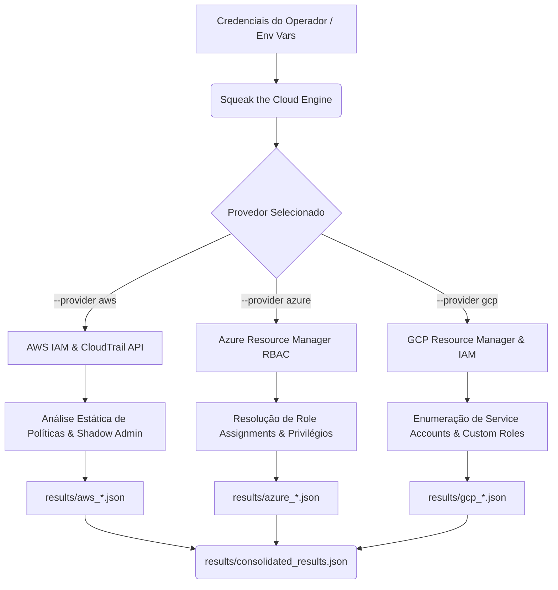

<p align="center">
  <!-- Substitua pelo link da imagem de banner/logo quando desejar -->
  
</p>

<p align="center">
  <a href="https://github.com/s3r4ph-0r4cul0/SqueakTheCloud/releases"></a>
  <a href="https://github.com/s3r4ph-0r4cul0/SqueakTheCloud/blob/main/LICENSE"></a>
  <a href="https://goreportcard.com/report/github.com/s3r4ph-0r4cul0/SqueakTheCloud"></a>
  <a href="https://twitter.com/s3r4ph_0r4cul0"></a>
</p>

<p align="center">
  <b>Squeak the Cloud</b> é uma ferramenta rápida, modular e focada em pós-exploração e inteligência em identidades (CIEM) para ambientes multi-cloud, escrita em Go. Ela automatiza o mapeamento de caminhos de escalada de privilégios (<b>Shadow Admin</b>), vetores de movimentação lateral e gaps de OPSEC em AWS, Azure e GCP.
</p>

---

## ⚡ Recursos

*   **Rápido e Portátil**: Escrito em Go, compila em um único binário estático e leve, pronto para ser executado em servidores de salto (jump boxes) ou direto do terminal do operador.
*   **Detecção de Shadow Admin**: Mecanismo de análise estática que detecta caminhos ocultos de escalada de privilégios a partir de identidades limitadas.
*   **Mapeamento de Superfície e Movimentação Lateral**: Encontra chaves de API expostas, contas de serviço desativadas mas com chaves válidas e atribuições de permissão complexas.
*   **Avaliação de OPSEC**: Verifica se logs de auditoria cruciais (como AWS CloudTrail) estão ativos e cobrindo todas as regiões antes de você realizar ações barulhentas.
*   **Saída Estruturada**: Resultados granulares gerados em JSON, perfeitos para ingestão em analisadores de grafos (BloodHound, Cartography, etc.) e scripts de automação.

---

## 🛠️ Como Funciona

O **Squeak the Cloud** interage diretamente com as APIs nativas de cada nuvem usando as credenciais configuradas na sessão, simulando as ações de reconhecimento pós-comprometimento de um atacante.



---

## 🚀 Instalação

### Compilando do Código-Fonte

Certifique-se de ter o **Go 1.25+** instalado em seu sistema:

```bash
git clone https://github.com/s3r4ph-0r4cul0/SqueakTheCloud.git
cd SqueakTheCloud
go mod tidy
go build -o squeak-audit main.go
```

---

## 💻 Uso e Opções da CLI

```bash
./squeak-audit -h
```

Isso exibirá a ajuda do binário:

```text
Usage of ./squeak-audit:
  -provider string
    	cloud provider: aws, azure, gcp (required)
```

### Configuração de Credenciais

Antes de rodar a ferramenta, configure o acesso no ambiente do terminal:

*   **AWS**: `aws configure` ou `export AWS_ACCESS_KEY_ID=...`
*   **Azure**: `az login`
*   **GCP**: `gcloud auth application-default login` ou `export GOOGLE_APPLICATION_CREDENTIALS=path_to_keys.json`

### Exemplos de Execução

#### 🟡 Reconhecimento e Shadow Admin na AWS
```bash
./squeak-audit --provider aws
```

#### 🔵 Mapeamento de RBAC e Atribuições na Azure
```bash
export AZURE_SUBSCRIPTION_ID="00000000-0000-0000-0000-000000000000" # Opcional
./squeak-audit --provider azure
```

#### 🟢 Enumeração de Contas de Serviço e Custom Roles no GCP
```bash
export GCP_PROJECT_ID="target-project-id" # Opcional
./squeak-audit --provider gcp
```

---

## 🔍 Vetores de Ataque Analisados

Selecione um provedor de nuvem para inspecionar os vetores enumerados e analisados pelo Squeak:

<details>
<summary>AWS (Amazon Web Services)</summary>
<br>

*   **Shadow Admin**: Detecção de 14 permissões de IAM críticas que permitem escalada:
    *   `iam:CreateAccessKey` (criação de chaves em contas alheias)
    *   `iam:CreateLoginProfile` / `iam:UpdateLoginProfile` (definição de senhas do console)
    *   `iam:AttachUserPolicy` / `iam:AttachRolePolicy` / `iam:AttachGroupPolicy` (vinculação de AdministratorAccess)
    *   `iam:PutUserPolicy` / `iam:PutRolePolicy` / `iam:PutGroupPolicy` (escrita de inline policies administrador)
    *   `iam:AddUserToGroup` (inclusão em grupos privilegiados)
    *   `iam:PassRole` (delegação de roles elevadas para instâncias ou funções)
    *   `lambda:CreateFunction` / `lambda:UpdateFunctionCode` (execução remota via lambda)
    *   `iam:CreatePolicyVersion` (alteração de versões de políticas para bypassar restrições)
*   **Contas Vulneráveis**: Mapeamento de chaves antigas (>90 dias) e status de MFA.
*   **OPSEC / Evitação de Detecção**: Auditoria do CloudTrail para verificar onde logs de eventos estão ativos e quais regiões não possuem cobertura.
</details>

<details>
<summary>Azure (Microsoft Azure)</summary>
<br>

*   **Sequestro de Assinatura**: Análise de Role Definitions customizadas que contêm permissões de escalada de privilégios no RBAC:
    *   `Microsoft.Authorization/roleAssignments/write` (concessão de papéis elevados)
    *   `Microsoft.Authorization/roleDefinitions/write` (modificação de regras de funções)
    *   `Microsoft.Compute/virtualMachines/runCommand/action` (execução remota SYSTEM/Root)
    *   `Microsoft.Compute/virtualMachines/write` (associação de identidades gerenciadas mais fortes)
    *   `Microsoft.Resources/deployments/write` (deploy de templates maliciosos)
    *   `Microsoft.Automation/automationAccounts/runbooks/write` (runbooks administrativos)
    *   `Microsoft.ManagedIdentity/userAssignedIdentities/assign/action` (atribuição de identidades a recursos)
*   **Mapeamento de Identidades**: Resolução dinâmica de atribuições complexas para encontrar usuários, grupos e Service Principals de alta relevância (Owner, Contributor, etc.).
</details>

<details>
<summary>GCP (Google Cloud Platform)</summary>
<br>

*   **Escalação Lateral e Impersonificação**: Detecção de permissões em Custom Roles:
    *   `iam.serviceAccounts.actAs` (agir em nome de uma Service Account com privilégios superiores)
    *   `iam.serviceAccounts.getAccessToken` (geração de tokens OAuth2 temporários)
    *   `iam.serviceAccounts.signBlob` / `iam.serviceAccounts.signJwt` (forjamento de assinaturas)
    *   `iam.serviceAccounts.setItemPolicy` (alteração de políticas da Service Account)
    *   `resourcemanager.projects.setItemPolicy` (escrita de IAM no escopo do projeto)
    *   `compute.instances.create` (criação de VMs associadas a Service Accounts privilegiadas)
    *   `deploymentmanager.deployments.create` (implantação de templates com privilégio Owner)
*   **Chaves de Persistência**: Varre chaves criadas por usuários (`USER_MANAGED`), idade de chaves e identificação de contas desativadas com credenciais ainda ativas.
</details>

---

## 📊 Estrutura de Resultados

Os resultados coletados são gravados de forma granular na pasta `./results/` em formato JSON de acordo com o provedor:
- **AWS**: `aws_iam_role_*.json`, `aws_iam_user_*.json`, `aws_oidc_provider_*.json`, `aws_saml_provider_*.json`, `aws_account_security.json`, `aws_logging_security.json`
- **Azure**: `azure_role_*.json`, `azure_role_assignment_*.json`
- **GCP**: `gcp_role_*.json`, `gcp_service_account_*.json`

Ao final de cada execução, a ferramenta consolida um índice em `consolidated_results.json` mapeando os relatórios gerados:

```json
{
  "provider": "aws",
  "files": [
    "aws_account_security.json",
    "aws_iam_role_1.json",
    "aws_iam_role_2.json",
    "aws_iam_user_1.json",
    "aws_logging_security.json"
  ]
}
```

---

## 📄 Licença

Este projeto está sob a licença [MIT](https://github.com/s3r4ph-0r4cul0/SqueakTheCloud/blob/main/LICENSE).

---

<p align="center">
  <i>"Yes, I am a criminal. My crime is that of curiosity. My crime is that of judging people by what they say and think, not what they look like. My crime is that of outsmarting you, something that you will never forgive me for."</i><br>
  — <b>The Mentor</b>, <a href="https://phrack.org/issues/7/3">The Conscience of a Hacker</a> (Phrack Issue 7, Phile 3)
</p>

